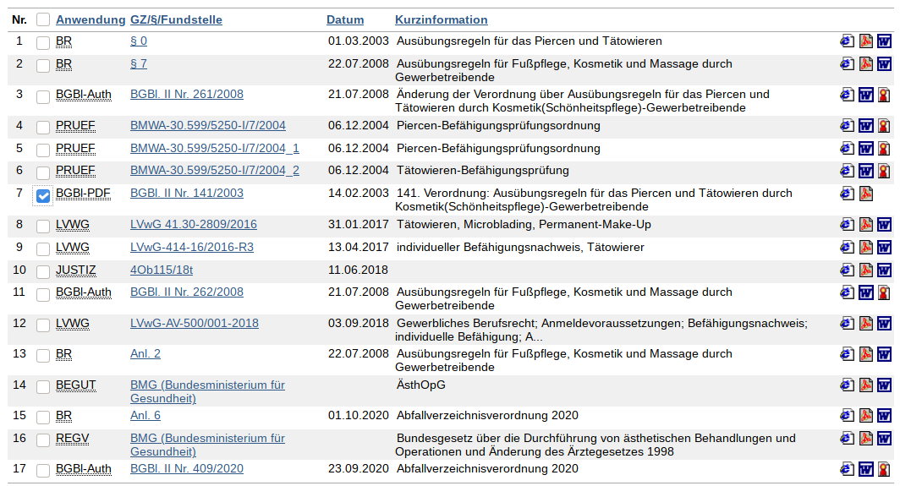
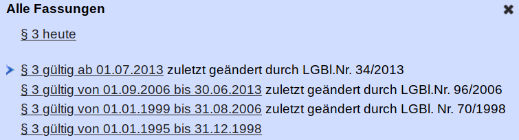

# Rechtsinformationsrecherche im Internet

#### Daniel Bartolot (01526618)

# Uebersicht

-   [Beispiel 1](#beispiel-1)
-   [Beispiel 2](#beispiel-2)
-   [Beispiel 3](#beispiel-3)
-   [Beispiel 4](#beispiel-4)
-   [Beispiel 5](#beispiel-5)
-   [Beispiel 6](#beispiel-6)
-   [Beispiel 7](#beispiel-7)
-   [Beispiel 8](#beispiel-8)
-   [Beispiel 9](#beispiel-9)
-   [Beispiel 10](#beispiel-10)

## Beispiel 1

**Mit welchem BGBL wurde die COVID-19-Maßnahmenverordnung aufgehoben**
(1 Punkt)

BGBl. II Nr. 479/2020 
[Link](https://www.ris.bka.gv.at/eli/bgbl/ii/2020/463/P19/NOR40227288?Abfrage=Bundesnormen&Kundmachungsorgan=&Index=&Titel=&Gesetzesnummer=&VonArtikel=&BisArtikel=&VonParagraf=&BisParagraf=&VonAnlage=&BisAnlage=&Typ=&Kundmachungsnummer=&Unterzeichnungsdatum=&FassungVom=15.11.2020&VonInkrafttretedatum=&BisInkrafttretedatum=&VonAusserkrafttretedatum=&BisAusserkrafttretedatum=&NormabschnittnummerKombination=Und&ImRisSeitVonDatum=&ImRisSeitBisDatum=&ImRisSeit=Undefined&ResultPageSize=100&Suchworte=COVID-19-Ma%c3%9fnahmenverordnung&Position=1&SkipToDocumentPage=true&ResultFunctionToken=6ffec48b-fdd2-411d-92e0-7f58da31cb80)

_(Rechercheprozess: suchen im RIS nach COVID-19-Maßnahmenverordnung)_

* * *

## Beispiel 2

(3 Punkte)

-   **Wann wurde das ZTG 2019 zuletzt geändert**

    06.05.2020
    [Link](https://www.ris.bka.gv.at/eli/bgbl/i/2019/29/P119/NOR40223108?ResultFunctionToken=32f95389-8e0d-4455-b95d-6becedbebdf4&Position=1&Sort=1%7cDesc&Abfrage=Bundesnormen&Kundmachungsorgan=&Index=&Titel=&Gesetzesnummer=&VonArtikel=&BisArtikel=&VonParagraf=&BisParagraf=&VonAnlage=&BisAnlage=&Typ=&Kundmachungsnummer=&Unterzeichnungsdatum=&FassungVom=16.11.2020&VonInkrafttretedatum=&BisInkrafttretedatum=&VonAusserkrafttretedatum=&BisAusserkrafttretedatum=&NormabschnittnummerKombination=Und&ImRisSeitVonDatum=&ImRisSeitBisDatum=&ImRisSeit=Undefined&ResultPageSize=100&Suchworte=Ziviltechnikergesetz)

-   **Aufgrund welchen Gesetzes**

    [Link](https://www.ris.bka.gv.at/NormDokument.wxe?Abfrage=Bundesnormen&Gesetzesnummer=20010625&FassungVom=2020-11-16&Artikel=&Paragraf=118&Anlage=&Uebergangsrecht=)

-   **Von welchen Personen wurde der Initiativantrag zur Änderung eingebracht**

    Eva-Maria Himmelbauer, BSc

    [Link](https://www.parlament.gv.at/PAKT/VHG/XXVI/NRSITZ/NRSITZ_00068/TO_03861997.pdf)

    _(BGBl oben --> Nummer der Nationalratssitzung --> Tagesordnung)_

* * *

## Beispiel 3

(3 Punkte)

[Ris Abfrage](https://www.ris.bka.gv.at/Ergebnis.wxe?Abfrage=Bundesnormen&Kundmachungsorgan=&Index=&Titel=&Gesetzesnummer=&VonArtikel=&BisArtikel=&VonParagraf=&BisParagraf=&VonAnlage=&BisAnlage=&Typ=&Kundmachungsnummer=&Unterzeichnungsdatum=&FassungVom=16.11.2020&VonInkrafttretedatum=&BisInkrafttretedatum=&VonAusserkrafttretedatum=&BisAusserkrafttretedatum=&NormabschnittnummerKombination=Und&ImRisSeitVonDatum=&ImRisSeitBisDatum=&ImRisSeit=Undefined&ResultPageSize=100&Suchworte=COVID-19-Schutzma%C3%9Fnahmenverordnung&Position=1&SkipToDocumentPage=true)

-   **Wann wurde die COVID-19-Schutzmaßnahmenverordnung zuletzt geändert**

    [Link: COVID-19-Schutzmaßnahmenverordnung](https://www.ris.bka.gv.at/eli/bgbl/ii/2020/463/P0/NOR40227142?ResultFunctionToken=5a2ea9ee-1ab8-4058-94b6-64e8bafb5119&Position=1&SkipToDocumentPage=True&Abfrage=Bundesnormen&Kundmachungsorgan=&Index=&Titel=&Gesetzesnummer=&VonArtikel=&BisArtikel=&VonParagraf=&BisParagraf=&VonAnlage=&BisAnlage=&Typ=&Kundmachungsnummer=&Unterzeichnungsdatum=&FassungVom=16.11.2020&VonInkrafttretedatum=&BisInkrafttretedatum=&VonAusserkrafttretedatum=&BisAusserkrafttretedatum=&NormabschnittnummerKombination=Und&ImRisSeitVonDatum=&ImRisSeitBisDatum=&ImRisSeit=Undefined&ResultPageSize=100&Suchworte=COVID-19-Schutzma%c3%9fnahmenverordnung)
    | Änderung                  | Anderungsdatum |
    | :------------------------ | :------------- |
    | BGBl. II Nr. 472/2020     | 10.11.2020     |
    | BGBl. II Nr. 476/2020     | 11.11.2020     |
    | **BGBl. II Nr. 479/2020** | **15.11.2020** |

-   **Wie lautet der Langtitel**

    Verordnung des Bundesministers für Soziales, Gesundheit, Pflege und Konsumentenschutz, mit der die COVID-19-Schutzmaßnahmenverordnung – COVID-19-SchuMaV geändert wird (2. COVID-19-SchuMaV-Novelle)

-   **Wie lautet die Stammfassung**

    Verordnung des Bundesministers für Soziales, Gesundheit, Pflege und Konsumentenschutz, mit der besondere Schutzmaßnahmen gegen die Verbreitung von COVID-19 getroffen werden (COVID-19-Schutzmaßnahmenverordnung – COVID-19-SchuMaV)

    [Stammfassung = StF. - BGBl. II Nr. 463/2020](https://www.ris.bka.gv.at/eli/bgbl/II/2020/463)

* * *

## Beispiel 4

**Im Jahr 2019 wurde das Bundesgesetz über die Organisation
der Universitäten und ihre Studien (Universitätsgesetz 2002) geändert**
(3 Punkte)

[Such-Link](https://www.ris.bka.gv.at/Ergebnis.wxe?Abfrage=Bundesnormen&Kundmachungsorgan=&Index=&Titel=&Gesetzesnummer=&VonArtikel=&BisArtikel=&VonParagraf=&BisParagraf=&VonAnlage=&BisAnlage=&Typ=&Kundmachungsnummer=&Unterzeichnungsdatum=&FassungVom=16.11.2020&VonInkrafttretedatum=&BisInkrafttretedatum=&VonAusserkrafttretedatum=&BisAusserkrafttretedatum=&NormabschnittnummerKombination=Und&ImRisSeitVonDatum=&ImRisSeitBisDatum=&ImRisSeit=Undefined&ResultPageSize=100&Suchworte=Universit%c3%a4tsgesetz+2002&Position=1&Sort=1%7cDesc)

[Link](https://www.ris.bka.gv.at/eli/bgbl/i/2002/120/P6/NOR40211287?ResultFunctionToken=e894f130-74b5-41b2-88d5-f07a1910baed&Position=1&Sort=1%7cDesc&Abfrage=Bundesnormen&Kundmachungsorgan=&Index=&Titel=&Gesetzesnummer=&VonArtikel=&BisArtikel=&VonParagraf=&BisParagraf=&VonAnlage=&BisAnlage=&Typ=&Kundmachungsnummer=&Unterzeichnungsdatum=&FassungVom=16.11.2020&VonInkrafttretedatum=&BisInkrafttretedatum=&VonAusserkrafttretedatum=&BisAusserkrafttretedatum=&NormabschnittnummerKombination=Und&ImRisSeitVonDatum=&ImRisSeitBisDatum=&ImRisSeit=Undefined&ResultPageSize=100&Suchworte=Universit%c3%a4tsgesetz+2002)

[altLinkGlaubAberEsIstErster](https://www.ris.bka.gv.at/eli/bgbl/i/2002/120/P143/NOR40211288?ResultFunctionToken=e894f130-74b5-41b2-88d5-f07a1910baed&Position=1&Sort=1%7cDesc&Abfrage=Bundesnormen&Kundmachungsorgan=&Index=&Titel=&Gesetzesnummer=&VonArtikel=&BisArtikel=&VonParagraf=&BisParagraf=&VonAnlage=&BisAnlage=&Typ=&Kundmachungsnummer=&Unterzeichnungsdatum=&FassungVom=16.11.2020&VonInkrafttretedatum=&BisInkrafttretedatum=&VonAusserkrafttretedatum=&BisAusserkrafttretedatum=&NormabschnittnummerKombination=Und&ImRisSeitVonDatum=&ImRisSeitBisDatum=&ImRisSeit=Undefined&ResultPageSize=100&Suchworte=Universit%c3%a4tsgesetz+2002)

-   **Wie lautet die Nr. des BGBl aufgrund dessen die Änderung erfolgte**

    BGBl. I Nr. 3/2019 _(Link oben)_

-   **In welchem Teil des BGBl wurde die Änderung kundgemacht**

    Teil I

-   **Wie lautet das Datum der Kundmachung dieses BGBL**

    Datum der Kundmachung 09.01.2019

* * *

## Beispiel 5

**Die Gemeinde Engerwitzdorf hat Folgendes beschlossen:**
_Zur Abwehr von das örtliche Gemeinschaftsleben ungebührlicherweise
törendem Lärm ist die Verwendung oder der Betrieb folgender
Lärmquellen wie Elektrorasenmäher oder Rasenmäher mit
Verbrennungsmotoren, Häcksler, motorbetriebene Heckenscheren,
Kreis und Motorsägen, soferne sie nicht im Rahmen eines Gewerbe-
und Industriebetriebes Verwendung finden, während folgender Zeiten
verboten: (…)_
(3 Punkte)

-   **In welcher Rechtsvorschrift ist dies geregelt**

    [link engerwitzdorf](https://www.engerwitzdorf.at/Leben-in-Engerwitzdorf/Umwelt/Laerm/Rasenmaeherverbot)

    Aufgrund des §4 des Oö. Polizeistrafgesetzes idgF.
    darf die Gemeinde eine Engerwitzdorf
    derartige Verordnung beschliessen

-   **Wie lautet die Geschäftszahl der Verordnung**

    1390-000.001-0407-2002  
    [Link](https://www.ris.bka.gv.at/Dokument.wxe?ResultFunctionToken=d89b9844-1766-4db8-b0cd-1b22d8852134&Position=1&SkipToDocumentPage=True&Abfrage=Gemeinderecht&Titel=&Bundesland=&Gemeinde=&GZ=&Datum=18.11.2020&IndexTyp=Undefined&ImRisSeitVonDatum=&ImRisSeitBisDatum=&ImRisSeit=Undefined&ResultPageSize=100&Suchworte=engerwitzdorf&Dokumentnummer=GEMRE_OB_41605_1390_000_001_0407_2002)

-   **Wann tritt dies in Kraft**

    Diese Verordnung tritt mit 01.09.1994 in Kraft. Die bisherigen Verordnungen des Gemeinderates vom 25.05.1993 bzw. 19.12.1975 treten außer Kraft.

* * *

## Beispiel 6

**Wie lautet der Index zum Bundesrecht für Forschung 79/02 und 72/15
und in welcher Hauptgruppe ist Forschung gelistet**
(2 Punkte)

[Link  - Index des Bundesrechts](https://www.ris.bka.gv.at/UI/Bund/Bundesnormen/IndexBundesrecht.aspx?TabbedMenuSelection=BundesrechtTab)

1. Index: [79/02 Forschung](http://www.ris.bka.gv.at/Ergebnis.wxe?Abfrage=Bundesnormen&Index=79%2f02&VonParagraf=0&ResultPageSize=100)
    - Sachgebiet: 7 SCHULEN, WISSENSCHAFT, KIRCHE, KULTUR, SPORT
    - Hauptgruppe: 79 VÖLKERRECHTLICHE VERTRÄGE
    - Untergruppe: 79/02 Forschung

2. Index: [72/15 Forschung](http://www.ris.bka.gv.at/Ergebnis.wxe?Abfrage=Bundesnormen&Index=72%2f15&VonParagraf=0&ResultPageSize=100)
    - Sachgebiet: 7 SCHULEN, WISSENSCHAFT, KIRCHE, KULTUR, SPORT
    - Hauptgruppe: 72 WISSENSCHAFT, HOCHSCHULEN
    - Untergruppe: 72/15 Forschung

* * *

## Beispiel 7

**Wie lautet der Index zum Bundesrecht für Rechtswissenschaft 72/04
und 79/08 und in welcher Hauptgruppe ist Rechtswissenschaften gelistet**
(2 Punkte)

[Link  - Index des Bundesrechts](https://www.ris.bka.gv.at/UI/Bund/Bundesnormen/IndexBundesrecht.aspx?TabbedMenuSelection=BundesrechtTab)

2. Index: [72/04 Studienrichtung Rechtswissenschaft](http://www.ris.bka.gv.at/Ergebnis.wxe?Abfrage=Bundesnormen&Index=72%2f04&VonParagraf=0&ResultPageSize=100)
    - Sachgebiet: 7 SCHULEN, WISSENSCHAFT, KIRCHE, KULTUR, SPORT
    - Hauptgruppe: 72 WISSENSCHAFT, HOCHSCHULEN
    - Untergruppe: 72/04 Studienrichtung Rechtswissenschaft

1. Index: [79/08 Rechtswissenschaft](http://www.ris.bka.gv.at/Ergebnis.wxe?Abfrage=Bundesnormen&Index=79%2f08&VonParagraf=0&ResultPageSize=100)
    - Sachgebiet: 7 SCHULEN, WISSENSCHAFT, KIRCHE, KULTUR, SPORT
    - Hauptgruppe: 79 VÖLKERRECHTLICHE VERTRÄGE
    - Untergruppe: 79/08 Rechtswissenschaft

* * *

## Beispiel 8

(3 Punkte) 
[Ris Abfrage](https://www.ris.bka.gv.at/Ergebnis.wxe?Abfrage=Gesamtabfrage&SearchInAsylGH=False&SearchInAvn=False&SearchInAvsv=False&SearchInBegut=False&SearchInBgblAlt=False&SearchInBgblAuth=False&SearchInBgblPdf=True&SearchInBks=False&SearchInBundesnormen=False&SearchInDok=False&SearchInDsk=False&SearchInErlaesse=False&SearchInGbk=False&SearchInGemeinderecht=False&SearchInJustiz=False&SearchInKmGer=False&SearchInBvwg=False&SearchInLvwg=False&SearchInLgbl=False&SearchInLgblNO=False&SearchInLgblAuth=False&SearchInLandesnormen=False&SearchInNormenliste=False&SearchInPruefGewO=False&SearchInPvak=False&SearchInRegV=False&SearchInSpg=False&SearchInUbas=False&SearchInUmse=False&SearchInUpts=False&SearchInUvs=False&SearchInVerg=False&SearchInVfgh=False&SearchInVwgh=False&ImRisSeitVonDatum=&ImRisSeitBisDatum=&ImRisSeit=Undefined&ResultPageSize=100&Suchworte=374%2f1997&Position=1&SkipToDocumentPage=true) 
[Ris: BGBl 374/1997](https://www.ris.bka.gv.at/Dokument.wxe?ResultFunctionToken=4548e926-4010-4654-a53e-a37ac771fd60&Position=1&SkipToDocumentPage=True&Abfrage=Gesamtabfrage&SearchInAsylGH=False&SearchInAvn=False&SearchInAvsv=False&SearchInBegut=False&SearchInBgblAlt=False&SearchInBgblAuth=False&SearchInBgblPdf=True&SearchInBks=False&SearchInBundesnormen=False&SearchInDok=False&SearchInDsk=False&SearchInErlaesse=False&SearchInGbk=False&SearchInGemeinderecht=False&SearchInJustiz=False&SearchInKmGer=False&SearchInBvwg=False&SearchInLvwg=False&SearchInLgbl=False&SearchInLgblNO=False&SearchInLgblAuth=False&SearchInLandesnormen=False&SearchInNormenliste=False&SearchInPruefGewO=False&SearchInPvak=False&SearchInRegV=False&SearchInSpg=False&SearchInUbas=False&SearchInUmse=False&SearchInUpts=False&SearchInUvs=False&SearchInVerg=False&SearchInVfgh=False&SearchInVwgh=False&ImRisSeitVonDatum=&ImRisSeitBisDatum=&ImRisSeit=Undefined&ResultPageSize=100&Suchworte=374%2f1997&Dokumentnummer=1997_374_2) 
[PDF: BGBl 374/1997](https://www.ris.bka.gv.at/Dokumente/BgblPdf/1997_374_2/1997_374_2.pdf) 

-   **Wie lautet die Kurzinformation des BGBl 374/1997**

    Kurzinformation: "374. Verordnung: Suchtgiftverordnung – SV"

-   **In welchem Teil des BGBL kundgemacht**

    BGBl. II Nr. 374/1997, d.h. aus **Teil 2**

-   **Handelt es sich dabei um eine authentische Fassung**

    Nein, hierbei handelt es sich um keine authentische Fassungen.

* * *

## Beispiel 9

_Bei einer Tätowierung handelt es sich um einen Eingriff in
die körperliche Integrität einer Person, die ohne vorausgegangene
ausreichende Erklärung der Person rechtswidrig ist und zu
Schadenersatz berechtigt.
Eine solche Einwilligung setzt eine Aufklärung voraus.
Der Gerichtshof verwies dabei auf die Verordnung (VO) über
Ausübungsregeln für das Piercen und Tätowieren durch
Kosmetik(Schönheitspflege)-Gewerbetreibende.
Nach § 2 Abs 3 dieser Verordnung hat eine Aufklärung insbesondere
über die erforderliche Nachbehandlung der tätowierten Körperregion,
mögliche unerwünschte Reaktionen nach Vornahme der Tätowierung wie
allergische und entzündliche Reaktionen zu erfolgen._ (4 Punkte)

<!-- [bgbl 139/2003](https://www.ris.bka.gv.at/Dokumente/BgblPdf/2003_139_2/2003_139_2.pdf) 
[ris abfrage](https://www.ris.bka.gv.at/Ergebnis.wxe?Abfrage=Gesamtabfrage&SearchInAsylGH=False&SearchInAvn=False&SearchInAvsv=False&SearchInBegut=False&SearchInBgblAlt=False&SearchInBgblAuth=False&SearchInBgblPdf=True&SearchInBks=False&SearchInBundesnormen=False&SearchInDok=False&SearchInDsk=False&SearchInErlaesse=False&SearchInGbk=False&SearchInGemeinderecht=False&SearchInJustiz=False&SearchInKmGer=False&SearchInBvwg=False&SearchInLvwg=False&SearchInLgbl=False&SearchInLgblNO=False&SearchInLgblAuth=False&SearchInLandesnormen=False&SearchInNormenliste=False&SearchInPruefGewO=False&SearchInPvak=False&SearchInRegV=False&SearchInSpg=False&SearchInUbas=False&SearchInUmse=False&SearchInUpts=False&SearchInUvs=False&SearchInVerg=False&SearchInVfgh=False&SearchInVwgh=False&ImRisSeitVonDatum=&ImRisSeitBisDatum=&ImRisSeit=Undefined&ResultPageSize=100&Suchworte=139%2f2003&Position=1&SkipToDocumentPage=true) 
 
 
 

 -->

-   **Welches Gericht hat entschieden**

    [Kurier Artikel](https://kurier.at/chronik/oesterreich/ogh-urteil-tattoo-studios-muessen-kunden-ueber-die-risken-aufklaeren/400067255) 

    OGH (Obersten Gerichtshofs) entschied, dass laut [BGBl II Nr
    141/2003](https://www.ris.bka.gv.at/Dokumente/BgblPdf/2003_141_2/2003_141_2.pdf) alles geregelt sei, d.h. Tätowierer verpflichtet,
    den Kunden vor Erteilung dessen Einwilligung über
    die Risiken einer Tätowierung aufzuklären

-   **Wie lautet die Geschäftszahl der Entscheidung**

    (OGH - Urteil)[https://www.ris.bka.gv.at/Dokument.wxe?ResultFunctionToken=daf37304-6f75-4472-bd9b-29df8c6bf39f&Position=1&Abfrage=Justiz&Gericht=&Rechtssatznummer=&Rechtssatz=&Fundstelle=&AenderungenSeit=Undefined&SucheNachRechtssatz=False&SucheNachText=True&GZ=4Ob115%2f18t&VonDatum=&BisDatum=16.07.2018&Norm=&ImRisSeitVonDatum=&ImRisSeitBisDatum=&ImRisSeit=Undefined&ResultPageSize=100&Suchworte=&Dokumentnummer=JJT_20180611_OGH0002_0040OB00115_18T0000_000]

    Geschäftszahl: 4Ob115/18t

-   **Wo wurde die Verordnung kundgemacht**

    [BGBl II Nr 141/2003](https://www.ris.bka.gv.at/Dokumente/BgblPdf/2003_141_2/2003_141_2.pdf)

-   **Wann erfolgte die letzte Änderung der Verordnung**

    [Ris Link](https://www.ris.bka.gv.at/eli/bgbl/ii/2003/141/P0/NOR30002807?ResultFunctionToken=516ad01a-5fc5-4c6b-8ea1-79f7036d7f8e&Position=1&SkipToDocumentPage=True&Abfrage=Bundesnormen&Kundmachungsorgan=&Index=&Titel=Piercen+und+T%c3%a4towieren&Gesetzesnummer=&VonArtikel=&BisArtikel=&VonParagraf=&BisParagraf=&VonAnlage=&BisAnlage=&Typ=&Kundmachungsnummer=&Unterzeichnungsdatum=&FassungVom=19.11.2020&VonInkrafttretedatum=&BisInkrafttretedatum=&VonAusserkrafttretedatum=&BisAusserkrafttretedatum=&NormabschnittnummerKombination=Und&ImRisSeitVonDatum=&ImRisSeitBisDatum=&ImRisSeit=Undefined&ResultPageSize=100&Suchworte=)

    Änderung: [BGBl. II Nr. 261/2008](https://www.ris.bka.gv.at/eli/bgbl/II/2008/261), am **21.7.2008**

* * *

## Beispiel 10

_Sie möchten auf Ihrem Grundstück in Oberösterreich bauen.
In der Bauordnung findet sich folgende Bestimmung:
Der Neu-, Zu- oder Umbau von Gebäuden darf nur auf Grundflächen
bewilligt werden, für die eine Bauplatzbewilligung nach Maßgabe
der Bestimmungen der §§ 4 bis 7 vorliegt oder gleichzeitig mit
der Baubewilligung erteilt wird._ (3 Punkte)

gegoogelt -> [Link](https://www.ris.bka.gv.at/eli/lgbl/OB/1994/66/P3/LOO40013689?Position=1&Abfrage=Landesnormen&Bundesland=Ober%C3%B6sterreich&BundeslandDefault=Ober%C3%B6sterreich&Index=&Titel=BauO&Gesetzesnummer=&VonParagraf=&VonAnlage=&Kundmachungsnummer=&FassungVom=16.03.2017&VonInkrafttretedatum=&BisInkrafttretedatum=&VonAusserkrafttretedatum=&BisAusserkrafttretedatum=&ImRisSeitVonDatum=&ImRisSeitBisDatum=)

-   **Handelt es sich um Landes- oder Bundesrecht**

    Landesrecht

-   **Wie lautet der Index**

    93 Bauwesen

-   **Wann wurde dieses Gesetz das letzte Mal geändert
    (Datum der Kundmachung)**

    Zuletzt aktualisiert am 08.05.2013
    
