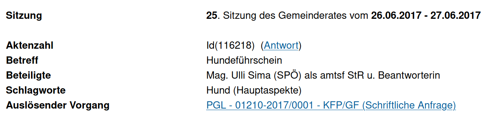

# Rechtsinformationsrecherche im Internet

#### Daniel Bartolot (01526618)

# Uebersicht

-   [Beispiel 1](#beispiel-1)
-   [Beispiel 2](#beispiel-2)
-   [Beispiel 3](#beispiel-3)
-   [Beispiel 4](#beispiel-4)
-   [Beispiel 5](#beispiel-5)
-   [Beispiel 6](#beispiel-6)
-   [Beispiel 7](#beispiel-7)
-   [Beispiel 8](#beispiel-8)
-   [Beispiel 9](#beispiel-9)
-   [Beispiel 10](#beispiel-10)

## Beispiel 1
**Welches Gericht hat folgendes Erkenntnis mit der Geschäftszahl V363/2020 gefällt? Wie lautet der Index der Entscheidung?**

VfGH - Verfassungsgerichtshof

Keine Bedenken gegen [§ 2 COVID-19-MaßnahmenG](https://360.lexisnexis.at/d/L-20011073-P2?origin=lk) im Hinblick auf Art18 Abs2 B VG und das Recht auf Freizügigkeit.

(von: [Link](https://360.lexisnexis.at/d/entscheidungen-ris/vfgh_v3632020/u_verfassung_VfGH_2020_JFT_20200714_20V_98c362de47))

* * *

## Beispiel 2
**Wie lautet die Stammfassung des Gesetzes vom 16. April 2020 über Maßnahmen zu COVID-19 in Verfahren der Raumplanung im Burgenland. Wann tritt dieses Gesetz außer Kraft**

StF: LGBl. Nr. 25/2020

Außerkrafttretensdatum: 31.12.2020

(von: [RIS](https://www.ris.bka.gv.at/eli/lgbl/BU/2020/25/P0/LBG40022491?ResultFunctionToken=e042da39-1b83-4153-bc8f-b79ef2eb19cc&Position=1&SkipToDocumentPage=True&Abfrage=Landesnormen&Kundmachungsorgan=&Bundesland=Burgenland&BundeslandDefault=Burgenland&Index=&Titel=&Gesetzesnummer=&VonArtikel=&BisArtikel=&VonParagraf=&BisParagraf=&VonAnlage=&BisAnlage=&Typ=&Kundmachungsnummer=&Unterzeichnungsdatum=&FassungVom=23.11.2020&VonInkrafttretedatum=&BisInkrafttretedatum=&VonAusserkrafttretedatum=&BisAusserkrafttretedatum=&NormabschnittnummerKombination=Und&ImRisSeitVonDatum=&ImRisSeitBisDatum=&ImRisSeit=Undefined&ResultPageSize=100&Suchworte=COVID-19))

* * *

## Beispiel 3
**Wie ist der Stand des parlamentarischen Verfahrens zum Forschungsorganisationsgesetz. Wie lautet der EuroVoc dazu? Wie lautet die Nr. des entsprechenden BGBl?**

- Stand: Plenarberatungen BR
- EuroVoc: "3211 Unterrichtswesen - Hochschulausbildung"
- BGBl vom letzten Stand: [BGBl. I Nr. 131/2015](https://www.ris.bka.gv.at/Dokument.wxe?Abfrage=BgblAuth&Dokumentnummer=BGBLA_2015_I_131)

(von: [RIS Gesetz](https://www.ris.bka.gv.at/eli/bgbl/1981/341/P0/NOR11009705?ResultFunctionToken=40d0b1a8-5b27-404e-b72b-2f878fefb7b9&Position=1&SkipToDocumentPage=True&Abfrage=Gesamtabfrage&SearchInAsylGH=True&SearchInAvn=True&SearchInAvsv=True&SearchInBegut=True&SearchInBgblAlt=True&SearchInBgblAuth=True&SearchInBgblPdf=True&SearchInBks=True&SearchInBundesnormen=True&SearchInDok=True&SearchInDsk=True&SearchInErlaesse=True&SearchInGbk=True&SearchInGemeinderecht=True&SearchInJustiz=True&SearchInKmGer=True&SearchInBvwg=True&SearchInLvwg=True&SearchInLgbl=True&SearchInLgblNO=True&SearchInLgblAuth=True&SearchInLandesnormen=True&SearchInNormenliste=True&SearchInPruefGewO=True&SearchInPvak=True&SearchInRegV=True&SearchInSpg=True&SearchInUbas=True&SearchInUmse=True&SearchInUpts=True&SearchInUvs=True&SearchInVerg=True&SearchInVfgh=True&SearchInVwgh=True&ImRisSeitVonDatum=&ImRisSeitBisDatum=&ImRisSeit=Undefined&ResultPageSize=100&Suchworte=Forschungsorganisationsgesetz),
[Parlament](https://www.parlament.gv.at/PAKT/VHG/XXV/I/I_00797/index.shtml))

>>>>

* * *

## Beispiel 4
**Wie ist der Stand des parlamentarischen Verfahrens zum COVID-19 Gesetz? Gibt es eine Regierungsvorlage dazu? Wann wurde es im NR eingebracht?**

- 15.03.2020 - Beschluss im Bundesrat 16/BNR
- Nein, hierbei handelt es sich um einen Initiativantrag (Antrag von Woeginger und Maurer).
- 14.03.2020 - Einbringung im Nationalrat

[Parlament](https://www.parlament.gv.at/PAKT/VHG/XXVII/A/A_00396/index.shtml)

>>>>

* * *

## Beispiel 5
_Der kleine Bub, der in Wien-Donaustadt von einem Rottweiler attackiert wurde, ist im Krankenhaus gestorben. Rottweiler stehen auf der Liste der gefährlichen Hunderassen, deren Besitzer_innen müssen den Hundeführschein machen. Wo ist die entsprechende Prüfung geregelt?_

- **Wie lautet die konkrete Bezeichnung der Rechtsvorschrift?**

    Wiener Hundeführscheinverordnung

    (von: [RIS](https://www.ris.bka.gv.at/eli/lgbl/WI/2005/59/P0/LWI40003955?ResultFunctionToken=deea74b4-595e-47ab-9e5b-5497a7260503&Position=1&SkipToDocumentPage=True&Abfrage=Gesamtabfrage&SearchInAsylGH=True&SearchInAvn=True&SearchInAvsv=True&SearchInBegut=True&SearchInBgblAlt=True&SearchInBgblAuth=True&SearchInBgblPdf=True&SearchInBks=True&SearchInBundesnormen=True&SearchInDok=True&SearchInDsk=True&SearchInErlaesse=True&SearchInGbk=True&SearchInGemeinderecht=True&SearchInJustiz=True&SearchInKmGer=True&SearchInBvwg=True&SearchInLvwg=True&SearchInLgbl=True&SearchInLgblNO=True&SearchInLgblAuth=True&SearchInLandesnormen=True&SearchInNormenliste=True&SearchInPruefGewO=True&SearchInPvak=True&SearchInRegV=True&SearchInSpg=True&SearchInUbas=True&SearchInUmse=True&SearchInUpts=True&SearchInUvs=True&SearchInVerg=True&SearchInVfgh=True&SearchInVwgh=True&ImRisSeitVonDatum=&ImRisSeitBisDatum=&ImRisSeit=Undefined&ResultPageSize=100&Suchworte=Wiener+Hundef%c3%bchrscheinverordnung))

- **Wann trat die Rechtsvorschrift in Kraft?**

    01.07.2010

- **Wann wurde die Führung von Hunden im Gemeinderat von Wien zuletzt behandelt?**

    25\. Sitzung des Gemeinderates vom 26.06.2017 - 27.06.2017

    
    (von: [wien.gv.at](https://www.wien.gv.at/infodat/ergdt?detvid=116218))

- **Wie lautet die Aktenzahl dazu?**

    Id(116218)

* * *

## Beispiel 6
_Der OGH beurteilte ein freundschaftliches Gerangel zwischen Jugendlichen auf einer Badeinsel mit dem Ziel, sich wechselseitig ins Wasser zu werfen, als sportähnliche Betätigung nach den Sonderregeln für die Sportausübung._

- **Wie lautet die Geschäftszahl der entsprechenden Entscheidung?**

    Geschäftszahl: 8Ob51/20p

    (von: [OGH](https://www.ogh.gv.at/entscheidungen/entscheidungen-ogh/schwerer-unfall-bei-rangelei-auf-einer-badeinsel/)
    &nbsp; -> &nbsp;
    [RIS](https://www.ris.bka.gv.at/Dokument.wxe?Abfrage=Justiz&Gericht=&Rechtssatznummer=&Rechtssatz=&Fundstelle=&AenderungenSeit=Undefined&SucheNachRechtssatz=False&SucheNachText=True&GZ=8Ob51%2f20p&VonDatum=&BisDatum=13.10.2020&Norm=&ImRisSeitVonDatum=&ImRisSeitBisDatum=&ImRisSeit=Undefined&ResultPageSize=100&Suchworte=&Position=1&SkipToDocumentPage=true&ResultFunctionToken=7da703f3-a329-41a3-a22f-a0947cce01d2&Dokumentnummer=JJT_20200825_OGH0002_0080OB00051_20P0000_000))

- **Wie viele Zeitschriften haben laut RDB dieses Thema behandelt?**

    2 (OeJZ und DiePresse)

    [OeJZ](https://rdb.manz.at/document/rdb.tso.ENoejzevblls2020221104?execution=e1s5&highlight=Rangelei+Badeinsel),
    [DiePresse](https://rdb.manz.at/document/rdb.tso.LIdiepresse20204303?execution=e1s5&highlight=Rangelei+Badeinsel)

* * *

## Beispiel 7
**In wie vielen Zeitschriften in der RDB ist die Entscheidung OGH 6 Ob 146/18s (Haftung des Reiseveranstalters) veröffentlicht (beurteilen Sie dies nach der Vorschau)? Wie viele Rechtssätze gibt es dazu?**

- Die Entscheidung wurde in 34 Ausgaben von 18 verschiedenen Zeitschriften veroeffentlicht. 

>>>>

* * *

## Beispiel 8
_Die Jugendschutzgesetze fallen heutzutage in Österreich in die Zuständigkeit der Bundesländer. Aus diesem Grund gibt es neun unterschiedliche Fassungen, die je nach Aufenthaltsort bis zum 18. Lebensjahr gelten. Im Theresianischen Gesetzbuch musste man hingegen erst verbieten, Kinder gegen Krankheiten in den Ofen zu stecken._

- **Wie lautet die Stammfassung des Wiener Jugendschutzgesetzes**

    StF.: LGBl. Nr. 17/2002

    (von: [RIS](https://www.ris.bka.gv.at/eli/lgbl/WI/2002/17/P0/LWI40005039?ResultFunctionToken=62c1efb6-678b-4075-b25f-df6e564d05b8&Position=1&SkipToDocumentPage=True&Abfrage=Landesnormen&Kundmachungsorgan=&Bundesland=Wien&BundeslandDefault=Wien&Index=&Titel=&Gesetzesnummer=&VonArtikel=&BisArtikel=&VonParagraf=&BisParagraf=&VonAnlage=&BisAnlage=&Typ=&Kundmachungsnummer=&Unterzeichnungsdatum=&FassungVom=23.11.2020&VonInkrafttretedatum=&BisInkrafttretedatum=&VonAusserkrafttretedatum=&BisAusserkrafttretedatum=&NormabschnittnummerKombination=Und&ImRisSeitVonDatum=&ImRisSeitBisDatum=&ImRisSeit=Undefined&ResultPageSize=100&Suchworte=Jugendschutzgesetz))

- **In welchem Kundmachungsorgan findet sich das historische Gesetz über Kinderarbeit und über die Arbeitszeit der Jugendlichen**

    BGBl. Nr. 599/1987

    (von: [RIS](https://www.ris.bka.gv.at/eli/bgbl/1987/599/P0/NOR40122527?ResultFunctionToken=da8c9a5b-fdbb-47ac-8f05-5010bd1d4551&Position=1&SkipToDocumentPage=True&Abfrage=Bundesnormen&Kundmachungsorgan=&Index=&Titel=&Gesetzesnummer=&VonArtikel=&BisArtikel=&VonParagraf=&BisParagraf=&VonAnlage=&BisAnlage=&Typ=&Kundmachungsnummer=&Unterzeichnungsdatum=&FassungVom=23.11.2020&VonInkrafttretedatum=&BisInkrafttretedatum=&VonAusserkrafttretedatum=&BisAusserkrafttretedatum=&NormabschnittnummerKombination=Und&ImRisSeitVonDatum=&ImRisSeitBisDatum=&ImRisSeit=Undefined&ResultPageSize=100&Suchworte=Bundesgesetz+%c3%bcber+die+Besch%c3%a4ftigung+von+Kindern+und+Jugendlichen+1987+-))

- **Wie lautet die Nummer des LGBL zum Gesetz vom 28. Jänner 1972 zum Schutz der Jugend**

    LGBL Nr. 7/1972

    (von: [LGBLs von 1972](http://alex.onb.ac.at/cgi-content/alex?apm=0&aid=lgw&datum=1972)
    &nbsp; -> &nbsp;
    [LGBL Nr. 7/1972](http://alex.onb.ac.at/cgi-content/alex?aid=lgw&datum=1972&page=21&size=45))

* * *

## Beispiel 9
**Was war der auslösende Vorgang zum Beschlussantrag PGL-536356-2020-KVP/GAT**

>"Ich fürchte mich nicht vor Corona, Corona ist nicht gefährlich. Da ist der Koran gefährlicher, meine Lieben, als Corona." - FPOe-Chef Norbert Hofer

Diese Aussage wurde zum ausloeser des oben genannten Beschlussantrags.

([Beschluss](https://www.wien.gv.at/ma08/infodat/2020/pgl-536356-2020-kvp-gat.pdf);
[OTS-Hetze und Verharmlosung](https://www.ots.at/presseaussendung/OTS_20200624_OTS0192/omar-al-rawi-spoe-rote-karte-fuer-hetze-und-verharmlosungis);
[OTS](https://www.ots.at/presseaussendung/OTS_20200624_OTS0191/70-wiener-gemeinderat-4);
[derStandard Query](https://www.derstandard.at/search?n=&fd=2020-06-15&td=2020-06-25&s=score&query=Norbert+hofer))

* * *

## Beispiel 10
_Im Ibiza Ausschuss wurde am 13. Sitzung vom 9. September 2020 eine Person vernommen_

- **Wer war diese Person**

    Wolfgang Sobotka (ÖVP)

    (von: [Sitzungsliste](https://www.parlament.gv.at/PAKT/VHG/XXVII/A-USA/A-USA_00002_00906/index.shtml#tab-Sitzungsueberblick)
    ->
    [13. Sitzung](https://www.parlament.gv.at/PAKT/VHG/XXVII/A-USA/A-USA_00002_00906/TO_04561557.pdf),
    [derStandard](https://www.derstandard.at/story/2000119473671/ladungsliste-fuer-ibiza-u-auschuss-veroeffentlicht))

- **Wann findet die nächste Sitzung statt**

    25.11.2020 (heute 24.11.2020; aus Sitzungsliste)
