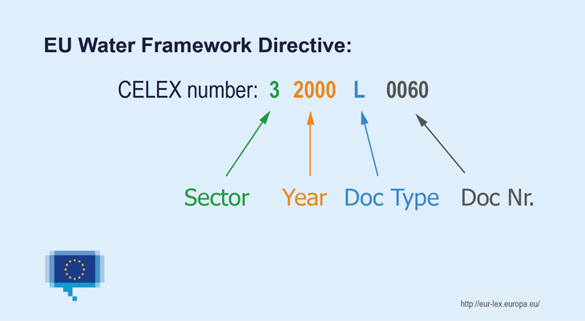

# Rechtsinformationsrecherche im Internet

## Uebung 3

#### Daniel Bartolot (01526618)

# Uebersicht

-   [Beispiel 1](#beispiel-1)
-   [Beispiel 2](#beispiel-2)
-   [Beispiel 3](#beispiel-3)
-   [Beispiel 4](#beispiel-4)
-   [Beispiel 5](#beispiel-5)
-   [Beispiel 6](#beispiel-6)
-   [Beispiel 7](#beispiel-7)
-   [Beispiel 8](#beispiel-8)
-   [Beispiel 9](#beispiel-9)

## Beispiel 1

_EU-Staaten dürfen die kurzzeitige Vermietung einer Wohnung an Touristen genehmigungspflichtig machen. Frankreich hatte eine entsprechende Genehmigungspflicht für den Großraum Paris eingeführt. Eigentümer zweier Appartements in Paris vermieteten ihre Wohnungen über Airbnb, ohne zuvor eine Genehmigung einzuholen. Die Stadt verhängte daraufhin Bußgelder. Die Eigentümer klagten und der EuGH musste die Frage klären, ob die nationale Richtlinie im Einklang mit europäischem Recht steht. 2020 gab es eine Entscheidung des EuGH_

-   **Wie lautet die GZ der EuGH Entscheidung**

    C-724/18

      _(von:
      [FAZ](https://www.faz.net/aktuell/wirtschaft/eugh-genehmigungspflicht-zur-kurzzeitvermietung-von-wohnungen-ist-rechtens-16965521.html),
      [URTEIL DES GERICHTSHOFS](https://eur-lex.europa.eu/legal-content/DE/TXT/?uri=CELEX%3A62018CJ0724&qid=1606562904025)
      )_

-   **Wer sind die Parteien dieses Verfahrens**

    -   Kläger: Cali Apartments SCI (C-724/18), HX (C-727/18)
    -   Beklagte: Procureur général près la cour d’appel de Paris, Ville de Paris

        _(von:
        [Amtsblatt der EU](https://eur-lex.europa.eu/legal-content/DE/TXT/?uri=CELEX%3A62018CA0724&qid=1606562904025)
        )_

-   **Welches Gericht hat die "Frage" beim EuGH vorgelegt**

      Vorlegendes Gericht: Cour de cassation

-   **Wer war der Berichterstatter im EuGH-Verfahren**

       D. Šváby (Berichterstatter)

       _(von:
       [URTEIL DES GERICHTSHOFS](https://eur-lex.europa.eu/legal-content/DE/TXT/?uri=CELEX%3A62018CJ0724&qid=1606562904025)
       )_

* * *

## Beispiel 2

_Im Rahmen eines vom OGH angestrengten Vorabentscheidungsverfahrens im Jahr 2011 hatte der EuGH zu klären, ob die Republik Österreich bei der Veröffentlichung von Firmenbuchdaten und der damit verbundenen Einhebung von Gebühren für Abfragen in diesem Register eine hoheitliche Tätigkeit ausübt oder als Unternehmer auftritt und ob sie berechtigt ist, die Weiterverwendung von Firmenbuchdaten zu untersagen_

-   **Wie lautet die GZ der OGH Entscheidung (Vorabentscheidung)**

    Geschäftszahl: 16Ok4/10

    _(von:
    [Entscheidungstext](https://www.ris.bka.gv.at/Dokument.wxe?ResultFunctionToken=3f6ff133-ee27-4471-ac56-4f971978f007&Position=1&SkipToDocumentPage=True&Abfrage=Justiz&Gericht=&Rechtssatznummer=&Rechtssatz=&Fundstelle=&AenderungenSeit=Undefined&SucheNachRechtssatz=True&SucheNachText=True&GZ=&VonDatum=01.01.2011&BisDatum=28.11.2012&Norm=&ImRisSeitVonDatum=&ImRisSeitBisDatum=&ImRisSeit=Undefined&ResultPageSize=100&Suchworte=firmenbuchdaten&Dokumentnummer=JJT_20110228_OGH0002_0160OK00004_1000000_000)
    )_

-   **Wie lautet die GZ der EuGH Entscheidung**

    _(von:
    [Urteil](https://eur-lex.europa.eu/legal-content/DE/TXT/?uri=CELEX%3A62011CJ0138&qid=1606565442704)
    )_

-   **Wie lautet die CELEX-Nr und was ist daraus abzuleiten (Erklärung der entsprechenden CELEX-Nr)**

    CELEX-Nummer: 62011CJ0138
    _(von:
    [EUR-Lex Abfrage](https://eur-lex.europa.eu/search.html?textScope0=ti-te&lang=de&SUBDOM_INIT=ALL_ALL&DTS_DOM=ALL&type=advanced&DTS_SUBDOM=ALL_ALL&textScope1=ti-te&qid=1606565442704&date0=ALL%3A01012011%7C01012013&andText1=firmenbuchdaten&andText0=%C3%96sterreich&locale=de)
    )_

    

    | Bereich/Sector    |      |
    | :-------------    | :------------- |
    | 1                 | Verträge|
    | 2                 | Internationale Abkommen|
    | 3                 | Rechtsakte|
    | 4                 | Ergänzende Rechtsvorschriften|
    | 5                 | Vorarbeiten|
    | 6                 | EU-Rechtsprechung|
    | 7                 | Nationale Umsetzung|
    | 8                 | Verweise auf die nationale Rechtsprechung mit Bezug zum EU-Recht|
    | 9                 | Parlamentarische Anfragen|
    | 0                 | Konsolidierte Fassungen|
    | C                 | Sonstige, im C-Amtsblatt veröffentlichte Dokumente|
    | E                 | EFTA-Dokumente|

    Art des Dokuments

    Jede Dokumentenart hat einen Deskriptor.
    Ein Deskriptor besteht aus einem oder zwei Buchstaben.

    (z.B.: L - Richtlinien, R - Verordnungen, D - Beschlüsse und Entscheidungen, CJ - Urteile des Gerichtshofs, CC - Schlussanträge des Generalanwalts, CO - Beschlüsse des Gerichtshofs)

    [Vollständige Liste der Deskriptoren](https://eur-lex.europa.eu/content/tools/TableOfSectors/types_of_documents_in_eurlex.html)

* * *

## Beispiel 3

_Ein Frischkäse, der in den Niederlanden produziert wird, hat zu einem Streit über Geschmack geführt. Die Frage, mit der sich der EuGH zu beschäftigen hatte, war, ob der Geschmack des Milchprodukts "einzigartig" sei. Nachdem nämlich ein Mitbewerber den "Witte Wievenkaas" auf den Markt gebracht hatte, war es mit der Einzigartigkeit vorbei, denn der Käse schmeckte genau wie der "Heksenkaas". Das niederländische Gericht, das darüber zu entscheiden hatte, wollte jedoch vorweg geklärt wissen, ob es überhaupt nach EU-Recht möglich ist, Geschmack urheberrechtlich zu schützen. Diese Frage war bis dahin noch nicht geklärt worden._

-   **Wie lautet die Geschäftszahl und Datum des Urteils**

    - Geschäftszahl: C-310/17
    - Datum des Urteils: 13. November 2018

    _(von:
    [FAZ](https://www.faz.net/aktuell/wirtschaft/eu-urteil-zu-urheberrecht-geschmack-laesst-sich-nicht-schuetzen-15888300.html),
    [Urteil](https://eur-lex.europa.eu/legal-content/DE/TXT/?uri=CELEX%3A62017CJ0310&qid=1606659716200)
    )_

-   **Wie lautet der Name des Generalanwalts**

    Generalanwalt: M. Wathelet

-   **Wie lautet die ECLI dieser Entscheidung und was ist daraus abzuleiten (Erklärung ECLI)**

    ECLI-Identifikator: ECLI:EU:C:2018:899

    Aufbau: 'ECLI:[\<Ländercode\>]:[\<Gerichtscode\>]:[\<Jahr der Entscheidung\>]:[\<einmalige Kennung\>]'

* * *

## Beispiel 4

_In Österreich ist für 2021 die nationale Umsetzung eines Meldesystems für Hinweisgeber geplant_

-   **Wie heißt die entsprechende RL (Volltext) auf EU-Ebene**

    Richtlinie (EU) 2019/1937 des Europäischen Parlaments und des Rates vom 23. Oktober 2019 zum Schutz von Personen, die Verstöße gegen das Unionsrecht melden

    _(von:
    [EUR-LEX](http://data.europa.eu/eli/dir/2019/1937/oj)
    )_

-   **Wann wurde diese RL im Amtsblatt veröffentlicht und wie lautet die Nr**

    Das Amtsblatt **L 305/17** veröffentlicht am **26.11.2019**

-   **Bis wann ist diese RL in Österreich umzusetzen**

    Bis **17. Dezember 2021** muessen in den Mitgliedstaaten die erforderlichen
    Rechts- und Verwaltungsvorschriften in Kraft treten um diese Richtlinie
    umzusetzen.
    Es gibt dabei jedoch eine Uebergangszeit bis 17. Dezember 2023
    um Abweichungen zu beheben.

* * *

## Beispiel 5

_Hauswirth produziert seit 1951 einen Schokohasen, hat ihn aber nie als Marke schützen lassen. Lindt verkauft seinen Hasen seit 1995 in Österreich, sicherte sich 2000 die Markenrechte und brachte 2004 eine einstweilige Verfügung gegen den Verkauf des Konkurrenzhasen von Hauswirth ein. Der OGH entschied: Hauswirth darf seinen Osterhasen mit der rot-weiß-roten Schleife in seiner heutigen Form nicht mehr verkaufen._

-   **Wie lautet die Geschäftszahl der OGH Entscheidung**

    Geschäftszahl: 17Ob17/09p

    _(von:
    [Urteil](https://www.ris.bka.gv.at/Dokument.wxe?ResultFunctionToken=1a0937df-f617-4245-a206-92d41573bbff&Position=1&Sort=2%7cAsc&Abfrage=Gesamtabfrage&SearchInAsylGH=True&SearchInAvn=True&SearchInAvsv=True&SearchInBegut=True&SearchInBgblAlt=True&SearchInBgblAuth=True&SearchInBgblPdf=True&SearchInBks=True&SearchInBundesnormen=True&SearchInDok=True&SearchInDsk=True&SearchInErlaesse=True&SearchInGbk=True&SearchInGemeinderecht=True&SearchInJustiz=True&SearchInKmGer=True&SearchInBvwg=True&SearchInLvwg=True&SearchInLgbl=True&SearchInLgblNO=True&SearchInLgblAuth=True&SearchInLandesnormen=True&SearchInNormenliste=True&SearchInPruefGewO=True&SearchInPvak=True&SearchInRegV=True&SearchInSpg=True&SearchInUbas=True&SearchInUmse=True&SearchInUpts=True&SearchInUvs=True&SearchInVerg=True&SearchInVfgh=True&SearchInVwgh=True&ImRisSeitVonDatum=&ImRisSeitBisDatum=&ImRisSeit=Undefined&ResultPageSize=100&Suchworte=hasen+verkauf&Dokumentnummer=JJT_20090922_OGH0002_0170OB00017_09P0000_000)
    )_

-   **Um welchen Dokumenttyp im RIS handelt es sich dabei**

    Dokumenttyp: Entscheidungstext

-   **Wie lauten die Schlagworte der OGH Entscheidung**

    Schlagworte: Goldhase IV

_Hingegen hat der EuGH entschieden, dass der Goldhase nicht über genügend spezielle Merkmale verfügt, die einen Schutz vor ähnlich aussehenden Produkten rechtfertigen würden_

-   **Wie lautet die Geschäftszahl und das Datum der EuGH Entscheidung**

    - Geschäftszahl: C-529/07
    - Datum der EuGH Entscheidung: 11. Juni 2009

    _(von:
    [EUR-LEX](https://eur-lex.europa.eu/legal-content/DE/TXT/?uri=CELEX%3A62007CJ0529&qid=1606674040662)
    )_

-   **Was war die rechtliche Grundlage dieser EuGH Entscheidung**

* * *

## Beispiel 6

_Der EuGH hat die österreichische Klage gegen Staatshilfen für das geplante britische Atomkraftwerk (AKW) Hinkley Point C endgültig abgewiesen. "Der Gerichtshof bestätigt den Beschluss, mit dem die Kommission die britischen Beihilfen zugunsten des Kernkraftwerks Hinkley Point C genehmigt hat"_

-   **Wie lautet die Geschäftszahl der EuGH Entscheidung**

    Geschäftszahl: C-594/18

    _(von:
    [Curia](http://curia.europa.eu/juris/liste.jsf?oqp=&for=&mat=or&jge=&td=%3BALL&jur=C%2CT%2CF&num=C-594%252F18&page=1&dates=&pcs=Oor&lg=&pro=&nat=or&cit=none%252CC%252CCJ%252CR%252C2008E%252C%252C%252C%252C%252C%252C%252C%252C%252C%252Ctrue%252Cfalse%252Cfalse&language=de&avg=&cid=15455069)
    )_

-   **Wer sind die Parteien des EuGH Verfahrens**

    - Klägerin: Republik Österreich

   - andere Parteien des Verfahrens:

       - Beklagte im ersten Rechtszug: Europäische Kommission

       - Streithelfer im ersten Rechtszug: Tschechische Republik, Französische Republik, Großherzogtum Luxemburg, Ungarn, Republik Polen, Slowakische Republik, Vereinigtes Königreich Großbritannien und Nordirland

-   **Welche Sachgebiete sind betroffen**

* * *

## Beispiel 7

-   **Wo und wie finden Sie das bilaterale Abkommen zwischen Österreich und Schweiz über die Anerkennung und Vollstreckung gerichtlicher Entscheidungen**

    <h1>??????????</h1>

    Auf der Webseite der Oesterreichischen Botschaft in Bern.
    [Link](https://www.bmeia.gv.at/oeb-bern/oesterreich-in-der-schweiz/vertraege/?tx_bmeiadb_piresults%5BsearchType%5D=bilateralTreaty&tx_bmeiadb_piresults%5Buid%5D=1372&tx_bmeiadb_piresults%5Baction%5D=single&cHash=d3c7c0a8bbcca62fcda839dce6c589f9)

-   **Wie lautet das entsprechende Bundesgesetzblatt**

    - Vertrag: BGBl. Nr. 125/1962
    - Nachfolgende Verträge: BGBl. Nr. 84/1968

* * *

## Beispiel 8

_Italien hat die Pandemie stark getroffen. Der Rat der EU hat vorgeschlagen, Italien eine vorübergehende Unterstützung zu gewähren, um die durch den COVID-19-Ausbruch bedingten Notlage Arbeitslosigkeitsrisiken zu mindern_

-   **Welche Dokumente finden Sie dazu in der EU-Datenbank**

    EU-Vorlagen (EU-V: U32 Offizielles Ratsdokument, EU-V: Beschluesse)

    <!-- [Abfrage](https://eur-lex.europa.eu/search.html?scope=EURLEX&text=%22Italien+mit+dem+Ziel%2C+in+der+durch+den+COVID%E2%80%9019%E2%80%90Ausbruch+bedingten+Notlage+Arbeitslosigkeitsrisiken+zu+mindern%22&lang=de&type=quick&qid=1606685756339)
     -->

-   **Wann ist dieser Vorschlag eingelangt**

    Eingangsdatum: 24.August 2020

-   **Welche Arbeitsgruppe hat diesen Vorschlag eingebracht**

    Gruppe: Gruppe der Finanzreferenten

    _(von:
    [parlament.gv.at](https://www.parlament.gv.at/PAKT/EU/XXVII/EU/03/01/EU_30124/index.shtml)
    )_

* * *

## Beispiel 9

-   **Bis wann läuft die Umsetzungsfrist in Österreich für die RL des Europäischen Parlaments und des Rates vom 14. November 2018 zur Änderung der Richtlinie 2010/13/ EU über audiovisuelle Mediendienste**

    Umsetzungsfrist: 19/09/2020

    _(von:
    [BKA](https://www.bundeskanzleramt.gv.at/agenda/medienrecht/rundfunk-und-medienrecht-in-europa.html),
    [Richtlinie (EU) 2018/1808](https://eur-lex.europa.eu/legal-content/DE/TXT/?uri=celex:32018L1808)
    )_

-   **Welche Maßnahmen wurden bisher in Österreich gesetzt**

    Bundesgesetz, mit dem das KommAustria-Gesetz (KOG) geändert wird;
    [BGBl. I Nr. 47/2019](https://www.ris.bka.gv.at/eli/bgbl/I/2019/47)

    <h1>????????????</h1>
